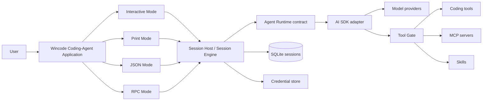

# Architecture

Wincode is a local-first terminal application for running coding agents. The
Coding-Agent Application owns the executable boundary and its Interactive,
Print, JSON, and RPC modes; reusable packages define model, agent, tool, and
Skill contracts without depending on the application, UI, or persistence layer.

## System shape



The Coding-Agent Application selects an Execution Mode. Modes share the
Session Host and Session Engine contracts: Interactive Mode renders live
state, Print and JSON project one-shot turns, and RPC exposes the stable
JSON-RPC protocol. Mode selection and process exit status stay outside the
Session Engine.

## Package boundaries

```text
.
├── packages/
│   ├── coding-agent/             # Executable dispatch, modes, OpenTUI, sessions, persistence, connections, MCP, approvals
│   ├── ai/                      # Provider-neutral model catalog, targets, options, usage, failures
│   ├── agent-core/              # Agents, Agent Turns, events, records, runtime and tool contracts
│   ├── agent-runtime-ai-sdk/    # Private AI SDK implementation and provider adapters
│   ├── coding-tools/            # Workspace sandbox plus read, search, edit, write, shell tools
│   └── skills/                  # Skill parsing, discovery, catalog, snapshots, activation
└── docs/
    └── adr/                     # Accepted architecture decisions
```

Dependency direction is inward toward contracts:

- `agent-core` does not import the Coding-Agent Application, persistence,
  OpenTUI, MCP, concrete tools, CLI, or AI SDK.
- AI SDK types stay inside `agent-runtime-ai-sdk` and are translated to
  Wincode contracts.
- `coding-agent` composes the reusable packages and keeps its mode adapters,
  React renderer, persistence, RPC projection, and process lifecycle at the
  application boundary.

## Agent Turn flow

1. The selected mode resolves the workspace, configuration, active Agent,
   model, variant, and provider credential.
2. It creates or opens a Session Host, whose Session Engine owns the live
   session state and durable writes.
3. The Agent Runtime invokes the provider and emits Wincode events for text,
   reasoning, tool calls, usage, failures, and completion.
4. Every tool call passes through the Tool Gate before coding tools, MCP
   servers, or Skills execute.
5. The mode projects the Host events and terminal outcome: Interactive Mode
   renders them, JSON Mode emits JSONL events, Print Mode emits assistant
   text, and RPC Mode emits its wire projection.

Streaming deltas and incomplete output remain transient. A failed, cancelled,
or interrupted turn is never replayed automatically; retry starts a new Agent
Turn from committed history.

## Local state

| Data | Storage |
| --- | --- |
| Configuration | Merged `wincode.jsonc` or `wincode.json` sources |
| Provider credentials | Platform secret store, with a secure local fallback |
| Sessions and compactions | Local SQLite database through Drizzle |
| Attachments | Content-addressed local files referenced by Session Records |
| Skills and custom commands | Global or workspace filesystem directories |

Session schema changes update the current Drizzle schema directly; this project does not maintain migration history.

## Safety boundaries

- The workspace sandbox limits filesystem operations to the active workspace unless `external_directory` permission allows access.
- The Tool Gate is the single enforcement point for `allow`, `ask`, and `deny` decisions.
- Explicit denies cannot be bypassed by auto approval or temporary grants.
- Local MCP commands are trusted configuration and execute in the user's workspace.
- Skill instructions are untrusted, turn-scoped context. Activating a Skill does not grant additional tool permissions.

## Model metadata

The Model Catalog in `packages/ai/src/catalog.ts` is the curated product allowlist. Reasoning levels, cost rates, cost tiers, and token limits are generated into `packages/ai/src/generated/model-metadata.generated.ts` from `https://models.dev/api.json`, read through `packages/ai/src/models-dev.ts` — the one converter, shared with the offline generator so a fetched value and a committed one cannot be interpreted differently.

```sh
bun run sync-model-metadata                   # regenerate the snapshot
bun run sync-model-metadata -- --check        # fail when it is stale
```

The snapshot is a build input, not a fetch dependency: a context limit resolves with no network at all, which is what keeps automatic compaction available offline. Facts the upstream does not publish are manual overlays in `packages/ai/scripts/metadata-model.ts` and are reported by name in the generated file's header.

## Architecture decisions

Detailed rationale lives in [`docs/adr/`](docs/adr/):

- [Coding-Agent application modes](docs/adr/0027-coding-agent-application-modes.md)
- [One Session Host per JSONL RPC process](docs/adr/0025-one-session-host-per-jsonl-rpc-process.md)
- [Session Host assembles and owns a session](docs/adr/0023-session-host-assembles-and-owns-a-session.md)
- [Model Catalog lifecycle](docs/adr/0012-model-catalog-lifecycle.md)
- [Reasoning as a request](docs/adr/0013-reasoning-as-request.md)
- [Model metadata pipeline](docs/adr/0014-model-metadata-pipeline.md)
- [Cost and limits in the catalog](docs/adr/0015-cost-and-limits-in-catalog.md)
- [Package graph and ownership](docs/adr/0010-agent-architecture-package-graph.md)
- [AI SDK isolation](docs/adr/0009-isolate-ai-sdk-behind-agent-runtime.md)
- [Agent-driven Skill activation](docs/adr/0004-agent-driven-skill-activation.md)
- [Two-tier session selection](docs/adr/0006-session-selection-two-tier.md)
- [Configured agents](docs/adr/0002-configured-agents.md)
- [Shell execution and permissions](docs/adr/0005-shell-tool-with-permission-gated-execution.md)
- [Typed normal-turn Prompt Composition Pipeline and Project Instructions](docs/adr/0017-typed-normal-turn-prompt-assembly.md)
