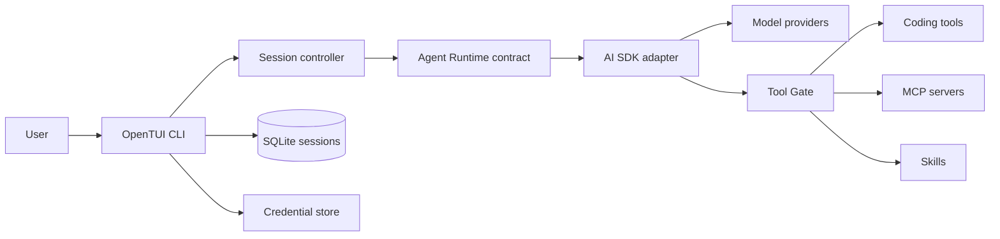

# Architecture

Wincode is a local-first terminal application for running coding agents. The CLI owns application composition; reusable packages define model, agent, tool, and Skill contracts without depending on the UI or persistence layer.

## System shape



The CLI is the composition root. It resolves configuration, credentials, Agent selection, model selection, tools, permissions, persistence, and presentation for each Agent Turn.

## Package boundaries

```text
.
├── wincode-cli/                  # OpenTUI UI, routing, sessions, config, credentials, MCP, approvals
├── packages/
│   ├── ai/                       # Provider-neutral model catalog, targets, options, usage, failures
│   ├── agent-core/               # Agents, Agent Turns, events, records, runtime and tool contracts
│   ├── agent-runtime-ai-sdk/     # Private AI SDK implementation and provider adapters
│   ├── coding-tools/             # Workspace sandbox plus read, search, edit, write, shell tools
│   └── skills/                   # Skill parsing, discovery, catalog, snapshots, activation
└── docs/
    └── adr/                      # Accepted architecture decisions
```
Dependency direction is inward toward contracts:

- `agent-core` does not import the CLI, persistence, OpenTUI, MCP, concrete tools, or AI SDK.
- AI SDK types stay inside `agent-runtime-ai-sdk` and are translated to Wincode contracts.
- The CLI adapts coding tools, MCP tools, and Skills to the generic tool interface.

## Agent Turn flow

1. The CLI merges configuration and resolves the active Agent, model, variant, and provider credential.
2. It builds a turn-scoped tool catalog and applies Agent and resource permission rules.
3. The Agent Runtime invokes the provider and emits Wincode events for text, reasoning, tool calls, usage, failures, and completion.
4. Every tool call passes through the Tool Gate before coding tools, MCP servers, or Skills execute.
5. The CLI renders live events and commits durable Session Records for accepted user input, completed tool calls, and the terminal assistant outcome.

Streaming deltas and incomplete output remain transient. A failed, cancelled, or interrupted turn is never replayed automatically; retry starts a new Agent Turn from committed history.

## Local state

| Data | Storage |
| --- | --- |
| Configuration | Merged `wincode.jsonc` or `wincode.json` sources |
| Provider credentials | Platform secret store, with a secure local fallback |
| Sessions and compactions | Local SQLite database through Drizzle |
| Attachments | Content-addressed local files referenced by Session Records |
| Skills and custom commands | Global or workspace filesystem directories |

Session schema changes update the current Drizzle schema directly; this project does not maintain migration history.

## Safety boundaries

- The workspace sandbox limits filesystem operations to the active workspace unless `external_directory` permission allows access.
- The Tool Gate is the single enforcement point for `allow`, `ask`, and `deny` decisions.
- Explicit denies cannot be bypassed by auto approval or temporary grants.
- Local MCP commands are trusted configuration and execute in the user's workspace.
- Skill instructions are untrusted, turn-scoped context. Activating a Skill does not grant additional tool permissions.

## Architecture decisions

Detailed rationale lives in [`docs/adr/`](docs/adr/):

- [Package graph and ownership](docs/adr/0010-agent-architecture-package-graph.md)
- [AI SDK isolation](docs/adr/0009-isolate-ai-sdk-behind-agent-runtime.md)
- [Agent-driven Skill activation](docs/adr/0004-agent-driven-skill-activation.md)
- [Two-tier session selection](docs/adr/0006-session-selection-two-tier.md)
- [Configured agents](docs/adr/0002-configured-agents.md)
- [Shell execution and permissions](docs/adr/0005-shell-tool-with-permission-gated-execution.md)
